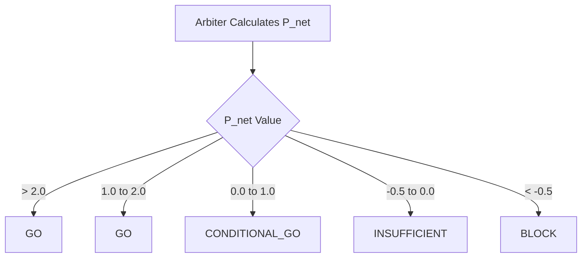

# Project Aegis: Epistemic Decision Gating

**Aegis** is a deterministic decision governance layer for autonomous systems (Trading, ML Deployment, Robotics).  
It enforces **truth first execution** by modeling uncertainty, missingness, and signal integrity blocking actions when the environment is unstable.

---

## Core Architecture

1. **Substrate**
   - A unified contract representing the system’s belief about reality.

2. **Integrity Tiers**
   - Evidence is weighted by source reliability:
     - Tier 1 → Signed Artifacts (highest trust)
     - Tier 4 → Human Assertions (lowest trust)

3. **MAER (Multi-Agent Epistemic Reasoning)**
   - Proponent → argues for action
   - Dissenter → argues against action
   - Arbiter → computes net pressure (`P_net`)

4. **Convergence Monitor**
   - Detects instability (“thrashing”)
   - Can trigger `SUBSTRATE_FREEZE`

---

## Installation
```bash
git clone https://github.com/youruser/Project_Aegis.git
cd project_aegis
```

## Quick Start

Run:
```bash
python main.py
```

This simulates a high-entropy network instability scenario where Aegis blocks unsafe execution.

## Example: main.py
```python
from dataclasses import dataclass
from aegis.schema import DecisionStatus, ExecutionStatus, IntegrityTier
from aegis.gatekeeper import DefaultGateway
from aegis.targeting import DefaultTargeting
from aegis.engine import Arbiter, ConvergenceMonitor
from aegis.controller import AegisController

# 1. Environment Policy
@dataclass
class TradingPolicy:
    go_threshold: float = 1.0
    block_threshold: float = -0.5

# 2. Evidence Artifact
@dataclass
class EvidenceArtifact:
    probe_id: str
    status: ExecutionStatus
    source_tier: IntegrityTier
    confidence: float
    content: dict

def run_simulation():
    aegis = AegisController(
        gateway=DefaultGateway(),
        targeting=DefaultTargeting(),
        arbiter=Arbiter(),
        monitor=ConvergenceMonitor(window_size=4, threshold=2),
        policy=TradingPolicy()
    )

    print(f"{'Tick':<5} | {'Artifact Status':<15} | {'Decision':<20} | {'Execute'}")
    print("-" * 70)

    scenarios = [
        EvidenceArtifact("NET_PROBE", ExecutionStatus.SUCCESS, IntegrityTier.TIER_1, 0.95, {"latency": "5ms"}),
        EvidenceArtifact("NET_PROBE", ExecutionStatus.TIMEOUT, IntegrityTier.TIER_1, 0.0, {}),
        EvidenceArtifact("NET_PROBE", ExecutionStatus.SUCCESS, IntegrityTier.TIER_1, 0.95, {"latency": "6ms"}),
        EvidenceArtifact("NET_PROBE", ExecutionStatus.TIMEOUT, IntegrityTier.TIER_1, 0.0, {}),
    ]

    for i, artifact in enumerate(scenarios):
        result = aegis.tick([artifact])

        print(
            f"{i+1:<5} | "
            f"{artifact.status.value:<15} | "
            f"{result.status.value:<20} | "
            f"{'YES' if result.can_execute else 'NO'}"
        )

    print("-" * 70)
    print("Simulation Complete: Aegis enforced a SUBSTRATE_FREEZE due to instability.")

if __name__ == "__main__":
    run_simulation()

```


## Decision Matrix (P_net Interpretation)
P_net = Net Epistemic Pressure
Represents margin of safety for execution.




## Operational Interpretation

| P_net Range | Status         | Meaning                     | Action          |
| ----------- | -------------- | --------------------------- | --------------- |
| > 2.0       | GO             | Strong consensus            | Execute         |
| 1.0 – 2.0   | GO             | Normal operating conditions | Execute         |
| 0.0 – 1.0   | CONDITIONAL_GO | Fragile state               | Reduce exposure |
| -0.5 – 0.0  | INSUFFICIENT   | Missing / unclear evidence  | Wait            |
| < -0.5      | BLOCK          | Active risk / failure       | Stop            |


## Troubleshooting & Calibration


**1. INSUFFICIENT_EVIDENCE**

- Symptom: System won’t move to GO

- Cause: Missing critical probe

- Fix:

   Check dominant_anchors
   Verify sensor reporting
   Remove stale requirements if needed

**2. SUBSTRATE_FREEZE**

- Symptom: System halts execution

- Cause: Rapid oscillation (thrashing)

- Fix:

   Identify unstable signal
   Wait for stabilization
   Optionally apply Tier-4 override → DIAGNOSTIC mode

**3. BLOCK Despite Human Override**

- Symptom: You say “GO,” system still blocks

- Cause: Tier weighting

   Tier 1 = strong
   Tier 4 = weak

- Fix:

   Provide corroborating evidence
   Fix underlying system signal
   Policy Tuning

   Adjust system sensitivity:
   
   - Increase go_threshold → more conservative
   - Decrease block_threshold → more tolerant
   - Increase ConvergenceMonitor.threshold → reduce freeze sensitivity
 

### What Aegis Actually Does
### Aegis is not a “smart model.”

- It is a:

   Deterministic execution gate that prevents unsafe actions under uncertainty

- It ensures:

   No action without sufficient evidence
   No action during instability
   No action when critical data is missing


## Key Output
```python
AegisAction(
    status=DecisionStatus,
    p_net=float,
    dominant_anchors=list[str],
    trace=str,
    can_execute=bool
)
```

## Core Principle

If reality is uncertain, unstable, or incomplete.........do nothing.


